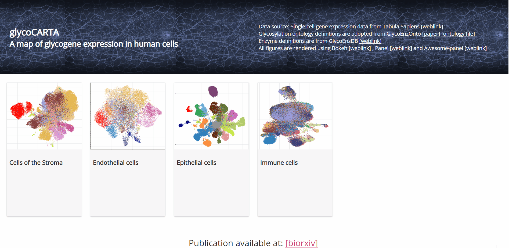
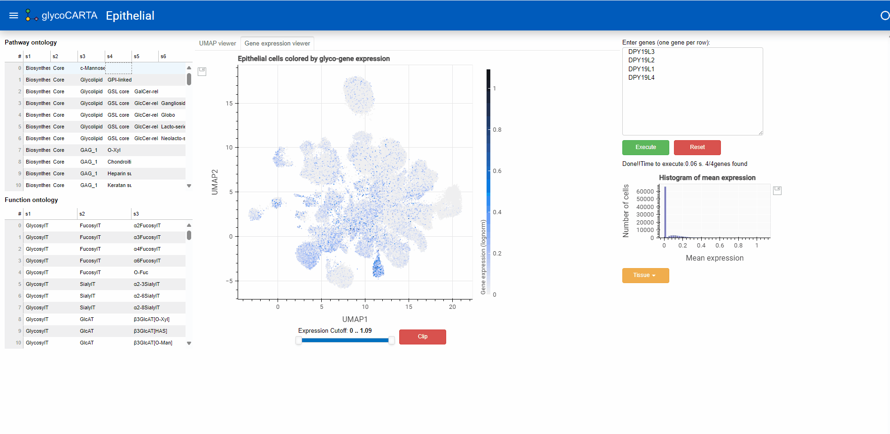
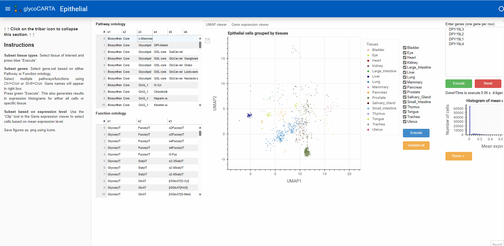
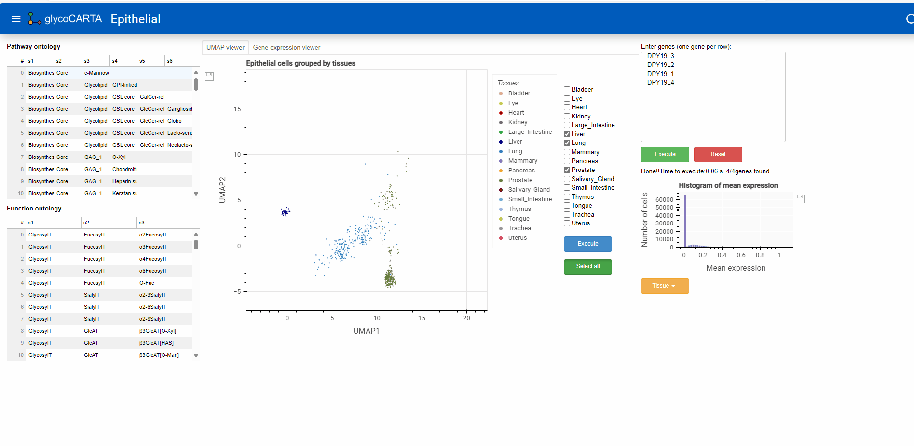
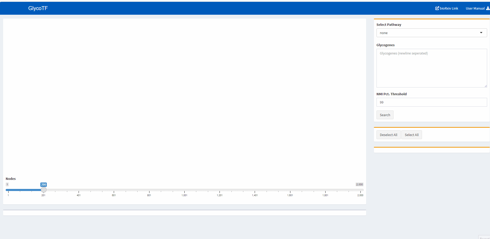
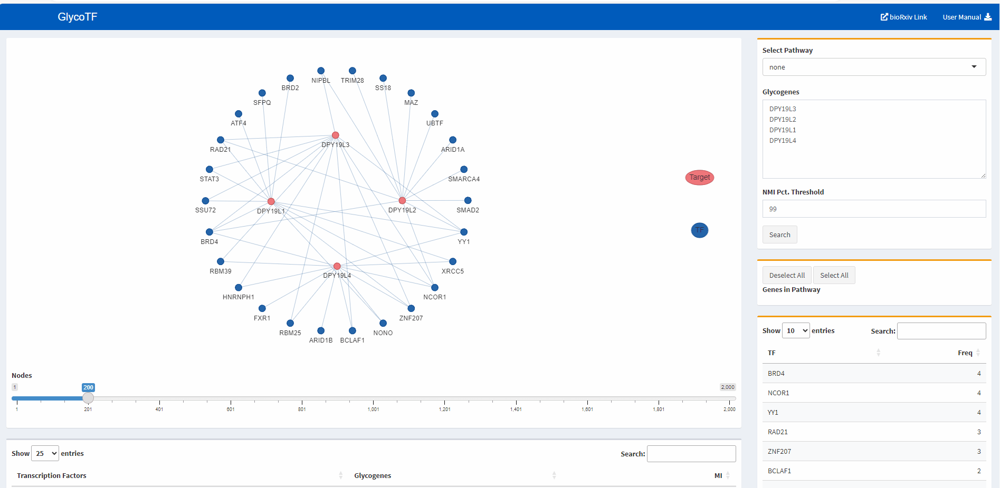

## Example Use Case: Analyzing the gene expression profile of C-Mannosyltransferases
---
[GlycoCARTA](http://vgdev.cedar.buffalo.edu/glycocarta/) is a webtool for exploring glycogene and glycopathway expression at single-cell level. 

* C-Mannosyltransferases (c-Man) mediate C-mannosylation of proteins on tryptophan residues.
* In this use case, we use glycoCARTA to explore the expression of c-Man pathway in epithelial cells. Besides epithelial cells, glycoCARTA provides analysis of endothelial, stromal, and immune cells.

* GlycoCARTA provides a UMAP viewer of scRNA-seq. The colors represent the tissue of origin.
* Glycogenes of interest can either be manually entered in the box on top right (one gene per line) or selected from the groups based on pathway or functional ontology (left panel). As illustrated in the animation above, we select the c_Man pathway which comprises the genes: DPY19L3, DPY19L2, DPY19L1, DPY19L4

* Once the genes are entered (press execute button), their average single-cell expression (log1p normalized) will appear in two ways:
  - a histogram of the gene expression (below the input box)
  - UMAP plot (by selecting  the Gene expression viewer tab at the top)

* In the Gene expression viewer, users can further filter the cells to be plotted based on expression threshold values (use the slider below). In the animation, we set the filter to show cells with an average expression >0.4.

* Users can also opt to show only cells from the specific tissue(s) of interest on the UMAP plot. In the animation, we find a group of cells with high expressions of GDP-Fucose genes. Here, we find that those cells are from Prostate, Liver and Lung tissues. 

* Users can also generate histogram of gene expression from cells of a specific tissue (e.g. Salivary gland), as illustrated in the animation. 
* Users can save a copy of any plot by pressing the floppy disk button next to the plot. 

The transcription factors for these can be further check on the webtool [GlycoTF](http://vgdev.cedar.buffalo.edu/glycotf).

In the following, we used glycoTF to identify candidate TFs for the four genes related to GDP-Fucose.
As illustrated below, genes can either be selected based on the list of pathways or entered in the search box (one gene per line). In the animation, we first select genes related to fucosylation and subsequently identify the four genes of interest: DPY19L3, DPY19L2, DPY19L1, DPY19L4.

Users can refine the set of glycogenes of interest after TF search by deselecting and then selecting the subset of genes of interest.  

The TF-gene information is provided in two ways: a table and a graph. 
The table gives the list of TF-gene whose mutual information (MI) scores are above the user-defined threshold (99 percentile in this use case).
The graph shows the top TF-gene link based on the scores. Users can adjust the number of linkages that they wish to visualize in the graph.  

