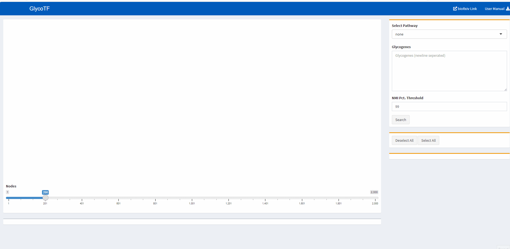

# glycoTS

This repository houses Python (Jupyter notebooks) and R codes used in the analysis of glycogene expressions in single-cell data of Tabula Sapiens. 

The work is described in the following manuscript:
P. Chrysinas, S. Venkatesan, I. Ang, V. Ghosh, C. Chen, S. Neelamegham, and Rudiyanto Gunawan. Cell and tissue-specific glycosylation pathways informed by single-cell transcriptomics, _bioRxiv_ 559616, 2023

Two webtools, glycoCARTA and glycoTF, are available for exploring glycogene and glycopathway expression and transcriptional regulation. These webtools are parts of Systems Glycobiology resource [virtualglycome.org](https://www.virtualglycome.org). In the following, we provide an example use case of glycoCARTA and glycoTF.

## Example Use Case: Analyzing the gene expression profile of C-Mannosyltransferases
---
[GlycoCARTA](https://www.virtualglycome.org) is a webtool for exploring glycogene and glycopathway expression at single-cell level. 

* C-Mannosyltransferases (c-Man) mediate C-mannosylation of proteins on tryptophan residues.
* In this use case, we use glycoCARTA to explor the expression of c-Man pathway in epithelial cells. Besides epithelial cells, glycoCARTA provides analysis of endothelial, stromal, and immune cells.

* The UMAP viewer shows the UMAP colored by the tissues available in TabulaSapiens.
* Genes can either be manually entered in column format (1 gene per line) in the text box or can be selected by either pathway or functional ontology to populate.

The Gene expression viewer can be used to show distribution of the mean expression of valid genes in the text box. The expression is log-normalized.
This can be further clipped by the expression values. Here, we filter  the cells to only values which are atleast 40% (0.4) of the maximum expression (1.09). 

* Going back to the UMAP viewer, we observe that majority of the highly expressed epithelial cells belong to the Prostate, Liver and Lung tissues. 

* We can observe the distribution of the expression through the histogram. The mode expression of cells (non-zero) is 0.4. 

The transcription factors for these can be further check on the webtool [glycoTF](https://www.virtualglycome.org).

[GlycoTF](https://vgdev.cedar.buffalo.edu/glycotf)

* glycoTF can now be utilized to observe the top transcription factors relating to these genes.
* glycoTF utilizes the TFLinks database to analyze transcription factor-glycogene relations as supported by TabulaSapiens data.
* Here, we select the 4 genes corresponding to GDP-Fucose (FCSK, FPGT, GMDS, GFUS)

The pathway dropdown can be used to select glycogenes by pathways.
The textbox allows entering genes in column format (1 gene per row)

* The links in the graph currently show the top 200 TF-target links which cross the 99th percentile threshold of Normalized Mutual Information (NMI). A lot of the links have very low Normalized Mutual Information. So, we further filter these to just the top 20 nodes. 

